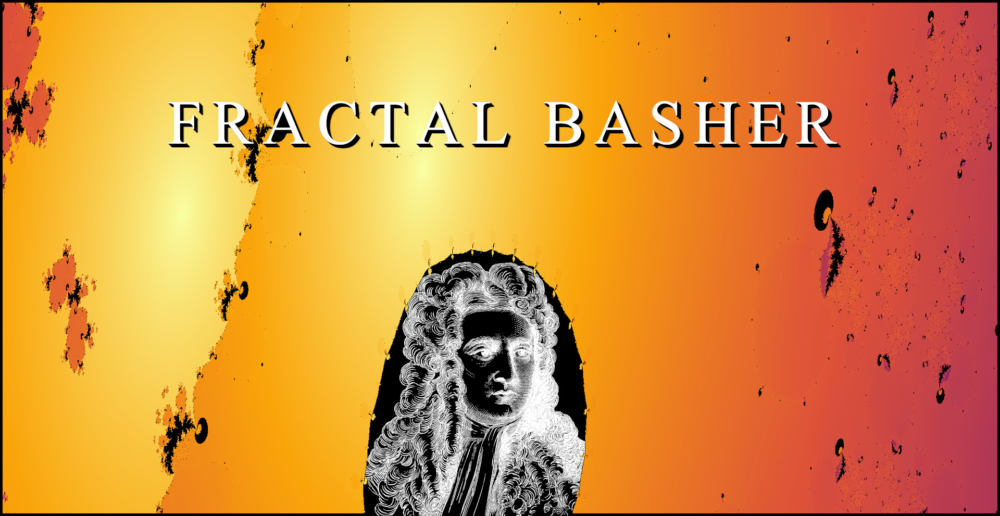

This was just something I was messing around with for fun.

This is a fractal basher - a PSO based system which tries to shape newtons fractals into silhouettes of images, written in MATLAB.

Using particle swarm optimisation, this simple MATLAB script attempts to configure a series of roots for a modified newtons fractal into the rough outline of some target silhouette for a cool visual effect. Originally a markov-chain annealing system was employed but this was generally much more unsuccessful.

This system does not work well and is more a test to see how plausible this idea was. At best it can manage kinds of blobbish approximations. Primitives and smooth shapes (eg ellipses) seem to work okay. When stuck it seems like reducing the number of roots is a good option to try.

Additionally i've included a script for generating still captures of approximated images and an animation script that uses second-order dynamics to interpolate between root configurations.

If anyone can recommend a better fractal to use, or a better optimisation strategy for navigating chaotic fractal behaviour, please feel free to reach out.

No LLM-derived code is used in this work.
